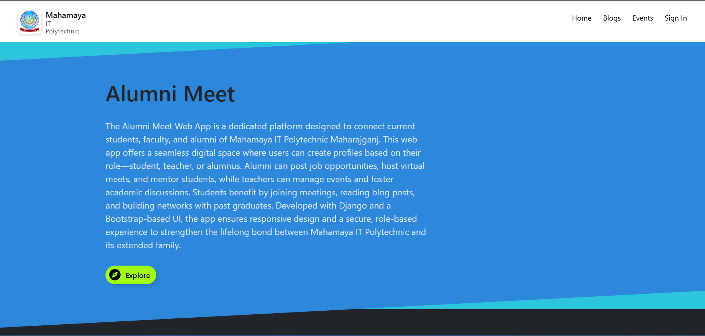
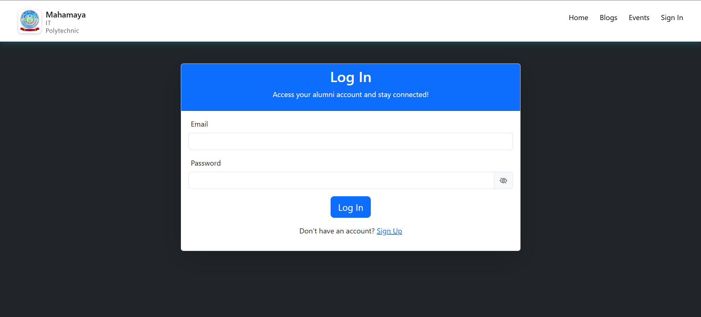
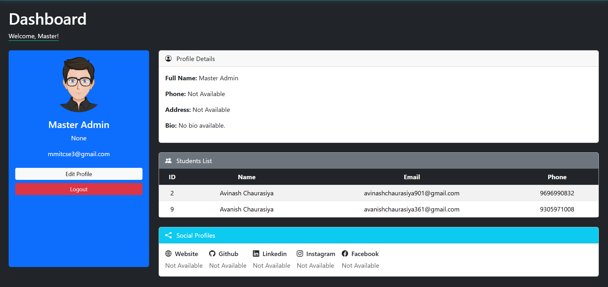
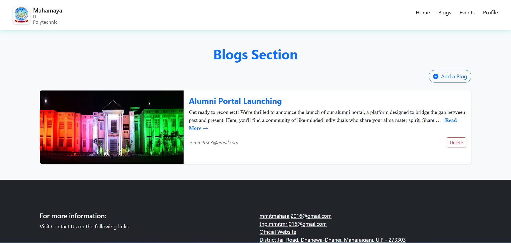
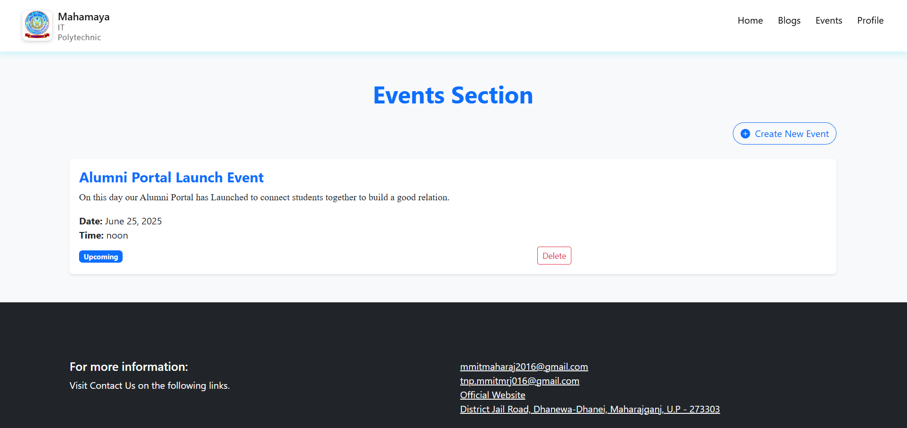

# 🎓 Alumni Meet

A Django-based web application to connect alumni, students, and teachers—fostering collaboration, networking, and engagement within your academic community.

---

## 🚀 Features

- 👤 **User Management:** Alumni, Students, and Teachers with secure authentication and profile management.
- 📝 **Blogs:** Alumni and teachers can share experiences and insights; all users can read and comment.
- 📅 **Events:** View upcoming, ongoing, and past events with detailed info.
- 📸 **Media Support:** Upload and display profile pictures and blog images.
- 📱 **Responsive Design:** Works seamlessly on desktops, tablets, and mobiles.

---

## 🛠️ Tech Stack

- **Backend:** Django 5.2
- **Frontend:** HTML5, CSS3, Bootstrap 5 and JavaScript
- **Database:** MYSql
- **Deployment:** Currently not deployed

---

## 📂 Project Structure

```plaintext
Alumni_Meet/
├── Alumni_App/
│   ├── Templates/         # HTML templates
│   ├── static/            # Static files (CSS, JS, images)
│   ├── models.py          # Database models
│   ├── views.py           # Application views
│   ├── admin.py           # Admin configurations
│   └── ...
├── Alumni_Meet/
│   ├── settings.py        # Project settings
│   ├── urls.py            # URL routing
│   └── ...
├── db.sqlite3             # SQLite database
├── manage.py              # Django management script
└── README.md              # Project documentation
```

---

## 🏁 Getting Started

### Prerequisites

- Python 3.10+
- Django 5.2
- pip

### Installation

1. **Clone the repository:**

   ```bash
   git clone https://github.com/your-username/alumni-meet.git
   cd alumni-meet
   ```

2. **Install dependencies:**

   ```bash
   pip install -r requirements.txt
   ```

3. **Apply migrations:**

   ```bash
   python manage.py makemigrations
   python manage.py migrate
   ```

4. **Run the development server:**

   ```bash
   python manage.py runserver
   ```

5. **Visit:** Currently not available

---

## 📸 Screenshots

**Landing Page**


**Log In  Page**


**Admin  Page**


**Blogs Page**


**Events  Page**


---

## 🤝 Contributing

1. Fork the repo
2. Create your feature branch (`git checkout -b feature/YourFeature`)
3. Commit your changes (`git commit -m 'Add some feature'`)
4. Push to the branch (`git push origin feature/YourFeature`)
5. Open a Pull Request

---

## 🛡️ License

This project is licensed under the MIT License.

---

## 📬 Contact

- Email: [avinashchaurasiya901@gmail.com](mailto:avinashchaurasiya901@gmail.com)
- College: [Mahamaya IT Polytechnic Maharajganj](https://www.mmitgp.ac.in)

---

## 🙏 Acknowledgments

Special thanks to the Mahamaya IT Polytechnic community and all contributors!

---

>_Made with ❤️ by Avinash Chaurasiya_
